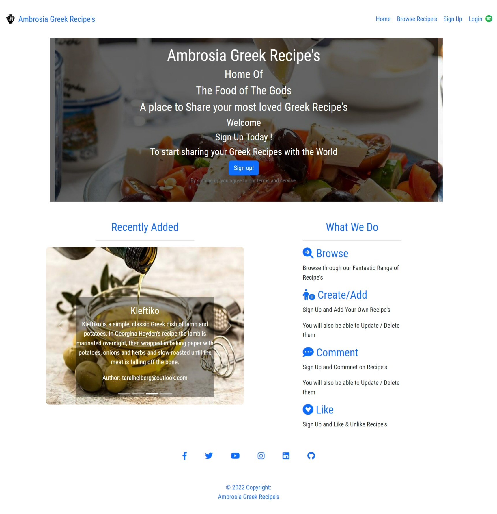
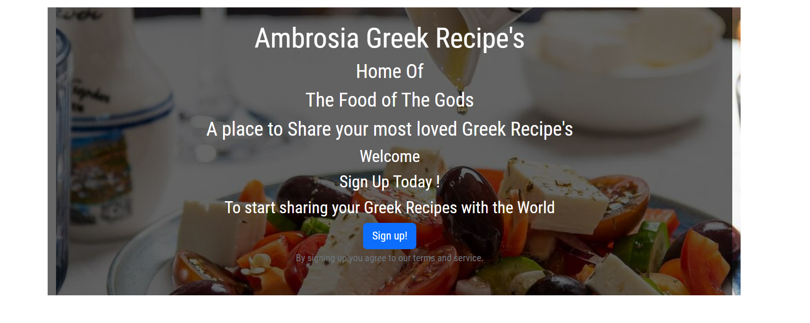
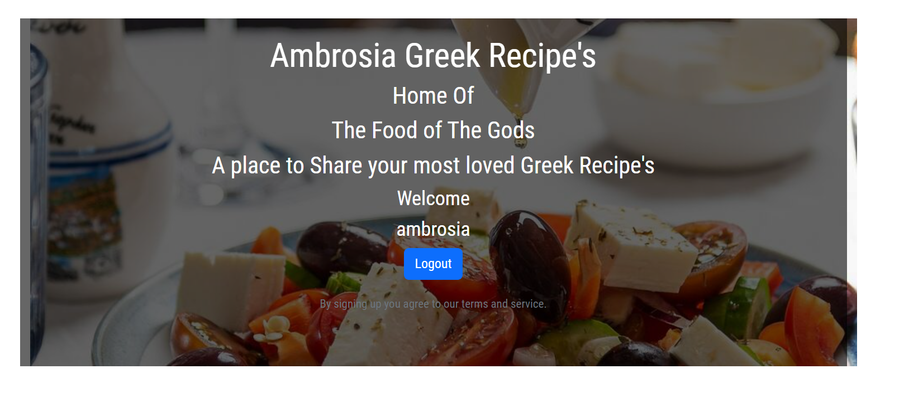
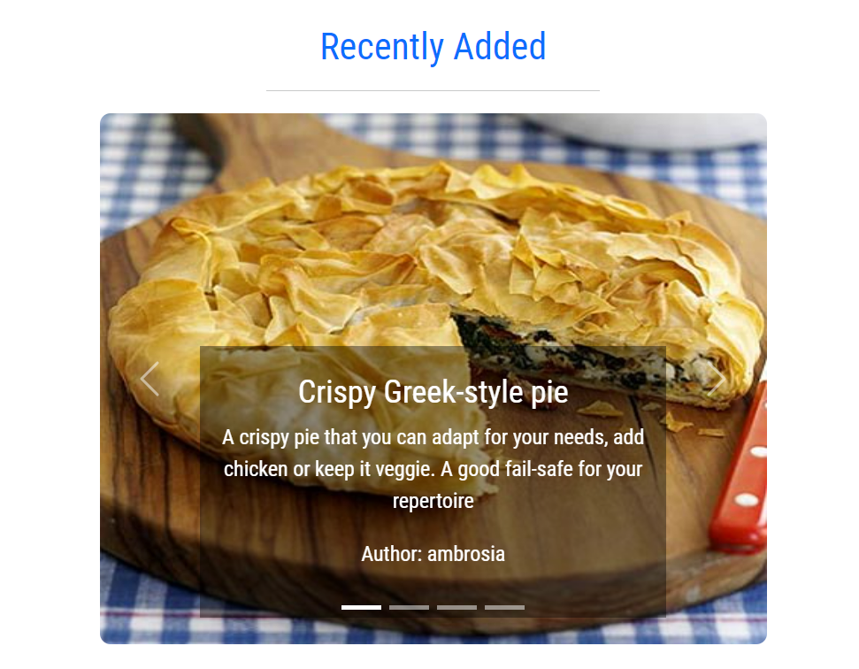
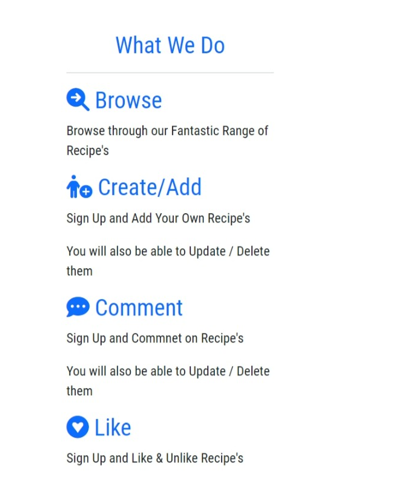
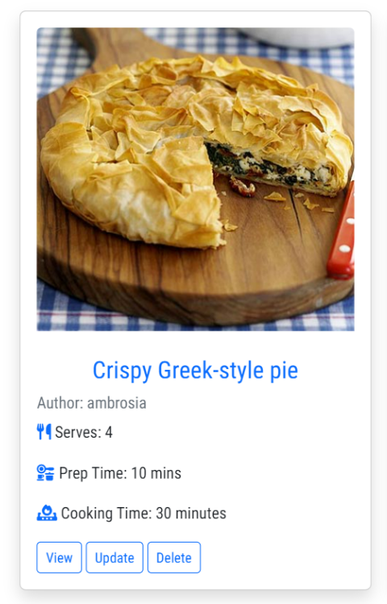

# Ambrosia Greek Recipe’s 

Live App link : [Ambrosia Greek Recipe's](https://ambrosia-greek-recipes.herokuapp.com/)

Ambrosia Greek Recipe’s is a user-friendly app that is base on the Greek Food and culture but is open to everyone who enjoys cooking and wishes to explore Greek Food and add their own recipes.
The site’s objective is to allow users to browse / view recipes weather they are a Registered user or not .
The site will allow a user to Register in order to add , update and delete their won recipes on the app and leave comments that the user can update or delete should they wish . Registered users can also like/unlike recipes.

# Contents

- [User Experience(UX)](#user-experience-ux)
   * [User Stories](#user-stories)
        * [Agile Method](#agile-method-git-projects) 
   * [Design](#design)
      * [Color Scheme](#colour-scheme)
      * [Images](#images)
      * [Font](#fonts)
      * [Wireframes(Balsamiq Wireframes)](#balsamiq-wireframes)
      * [Data Modle](#data-model)

- [Features](#features)
   * [HomePage](#home-page)

## User Experience UX

As a App Developer and Designer I have tried to incorporate the Needs of the User along with a User Friendly navigation and astheticly pleasing App. 
The App is designed for use for anyone who wishes to enjoy Greek Food and has a love of cooking.

## User Stories

I have used the Agile method starting with the Epics from which the User Stories are propogated and Task required to complete the User Stories. 

### EPIC | Home/Landing Page
- As a App Designer I require a Home/Landing Page so that the User can be introduced to the Recipes App and have a Definite place to Navigate and start using the app from.
  * [USER STORY: Navigation](https://github.com/TaraHelberg/Ambrosia-Greek-Recipe-s/issues/18)
       * [Tasks: Header, Title & Navigation](https://github.com/TaraHelberg/Ambrosia-Greek-Recipe-s/issues/22)
  * [USER STORY: Social Media App Links](https://github.com/TaraHelberg/Ambrosia-Greek-Recipe-s/issues/19)
       * [Tasks: Footer & Social Media Links](https://github.com/TaraHelberg/Ambrosia-Greek-Recipe-s/issues/23)
  * [USER STORY: Engaged in the App from the Start](https://github.com/TaraHelberg/Ambrosia-Greek-Recipe-s/issues/20)
       * [Tasks: Home Page Body -Engage User](https://github.com/TaraHelberg/Ambrosia-Greek-Recipe-s/issues/24)
       * [Tasks: Promote Registration Link](https://github.com/TaraHelberg/Ambrosia-Greek-Recipe-s/issues/25)

### EPIC | Browse Recipe's Page
- As a App Designer I require a Browse Recipe's Page so that App users can Browse the recipe's that they or others have added/posted even if the User is Registered user or not 
   * [USER STORY: Browse Recipes](https://github.com/TaraHelberg/Ambrosia-Greek-Recipe-s/issues/31)
       * [Tasks: Browse Recipe ](https://github.com/TaraHelberg/Ambrosia-Greek-Recipe-s/issues/32)
   * [USER STORY: Open a Recipe](https://github.com/TaraHelberg/Ambrosia-Greek-Recipe-s/issues/33) 
       * [Tasks: Open a Recipe to View entire recipe contents](https://github.com/TaraHelberg/Ambrosia-Greek-Recipe-s/issues/34)   

### EPIC | App Admin Manager
- As a App Designer I require an App Admin Manager so that The Admin Manager in charge of the App can oversee the Registered Users Posts & comments in order to moderate the App if needed
    * [USER STORY: App Admin Management](https://github.com/TaraHelberg/Ambrosia-Greek-Recipe-s/issues/28)
        * [Tasks: App Admin Management](https://github.com/TaraHelberg/Ambrosia-Greek-Recipe-s/issues/29)

### EPIC | User Profile 
- As a App Designer I require User Profile so that Potential users will have the ability to Register & Login to the App
    * [USER STORY: Account Registration & Login](https://github.com/TaraHelberg/Ambrosia-Greek-Recipe-s/issues/37)
        * [Tasks: Account Registration & Login/Log out ](https://github.com/TaraHelberg/Ambrosia-Greek-Recipe-s/issues/38)

### EPIC | Recipe Management
- As a App Designer I require a Registered User to be able to Add, Update & Delete Recipe as well as Comment on Recipes so that the Registered User can share Recipes to the Browse Recipe's page and Manage their Recipes for all Users to enjoy and add value to the App for All Users along with Registered users been able to add Comments for extra interaction with the App
    * [USER STORY Recipe Managment](https://github.com/TaraHelberg/Ambrosia-Greek-Recipe-s/issues/30)
        * [Tasks: Create a Recipe Front end ](https://github.com/TaraHelberg/Ambrosia-Greek-Recipe-s/issues/40)
        * [Tasks: Read Detail Recipe Front End](https://github.com/TaraHelberg/Ambrosia-Greek-Recipe-s/issues/41)
        * [Tasks: Update a Recipe Front End](https://github.com/TaraHelberg/Ambrosia-Greek-Recipe-s/issues/42)
        * [Tasks: Delete a Recipe Front End](https://github.com/TaraHelberg/Ambrosia-Greek-Recipe-s/issues/43)
        * [Tasks: Recipe Management - Comment On a Recipe](https://github.com/TaraHelberg/Ambrosia-Greek-Recipe-s/issues/39)
    * [USER STORY: Update & Delete Comments](https://github.com/TaraHelberg/Ambrosia-Greek-Recipe-s/issues/44)
        * [Tasks: Update & Delete Comments](https://github.com/TaraHelberg/Ambrosia-Greek-Recipe-s/issues/45)

### EPIC | Recipe Like's
- As a App Designer I can give my Registered Users the ability to like Recipes so that they have extra interaction with the App and can show to all users which recipes are more popular adding Value to the App 
    * [USER STORY: Likes ](https://github.com/TaraHelberg/Ambrosia-Greek-Recipe-s/issues/26)
        * [Tasks: Likes](https://github.com/TaraHelberg/Ambrosia-Greek-Recipe-s/issues/27)

### EPIC | Error Pages
- As a App Designer. I would require Error Handling pages so that any Errors that may occur due to either technical issues or access issues are handled, and that the user is informed and redirected accordingly if possible
    * [USER STORY: Error Pages](https://github.com/TaraHelberg/Ambrosia-Greek-Recipe-s/issues/47)
        * [Tasks: Error Pages](https://github.com/TaraHelberg/Ambrosia-Greek-Recipe-s/issues/48)

### Agile Method Git Projects

Github projects was used to manage the development process using an agile approach. Please see link to project [Kanban Board](https://github.com/TaraHelberg/Ambrosia-Greek-Recipe-s/issues?q=is%3Aissue+is%3Aclosed)

Not all Epics have made it into the projecy using the MSCW Method you will find on the Kandban Must have's,Should Have's,Could Have's and Wont have labels. The wont have labeled sections are those that did not make it into the App due to time constraint or due to design decision as in the case of the About Page.

### Design

The App has a very clean and simplistic design which was purposely chosen in order to keep the App looking and feeling Authenticaly Greek and Easy to Navigate.

#### Colour Scheme
Colour from BootStrap

Going with an Authentica Greek Themed App and choosing to stick to the colours most assosciated with Greece Blue and White this Developer was fortunate to choose Boostrap for many applications in this App a benifit of this been that Boostrap by default provided the Colour scheeme required for this App.

#### Images
There are four static image's on the App .
1. App Title Logo A Greek Urn
2. Hero Image a Greek Salad on the Home Page
3. BgIamge a meal-spices Image of Olive Oil and spices used as a background image for Forms
4. Place Holder image a small glass bowl with olive oil and olives used if a user does not upload a recipe image 
The rest of the imagery will be uploaded by users for their individual recipes. 

#### Images Credit for Project

 

Pixabay

    
* [Images obtained via Pixabay](https://pixabay.com/)
     + Image 1 . [apptitleLog-greek-urn](https://pixabay.com/vectors/europe-greece-greek-pottery-vase-2028128/)
    + Image 2 . [heroimage-greek-salad](https://pixabay.com/photos/salad-greek-salad-feta-food-plate-5904093/)
    + Image 3 . [bgimage-meal-spices](https://pixabay.com/photos/meal-spices-laurel-salt-pepper-3191933/)
    + Image 4 . [placeholder-olive-oil](https://pixabay.com/photos/olive-oil-olives-food-oil-natural-968657/)
 

#### Fonts
The font 'Roboto Condensed' is used as our main Body Font for the App. The Font IS imported via Google Fonts. Sans Serif is the backup font, in case for any reason the main font isn't being imported into the site correctly.

## Balsamiq Wireframes

Wireframe's are extreamly basic and did not incorporate all App pages. 
Wireframes where used as boiler plates to start the app design many updates and alterations made after the basic Wireframes where used to get started on the App.

Balsamiq Wireframes

Home Page 

Register 

Login 

LogOut 

Browse 

Recipe Details 

Add Recipe 

Update Recipe 

## Data Model

I used principles of Object-Oriented Programming throughout this project and Django’s Class-Based Generic Views.  

Django AllAuth was used for the user authentication system.
User Modal with the User_Id as the Primary Key

In order for the users to create recipes a custom recipe model was required. The recipe_id as the Primary Key and author as the foreign key to the User model given a recipe so that only one author can be connected to one recipe.

The Comment model allows users to comment on individual recipes and the Recipe_id is a foreign key in the comment model given a comment can only be linked to one recipe. 

The diagram below details the 

Database Flow Chart:

# Features

## Home Page 

Full Home Page Image :

 

The Home Page of the App incorporates the Following :

Header with App Title & Logo as well as Page Navigation included in is User Sign Up, Loging and Log out.

There is also included a spotify play list for the users enjoyment

Image of Header and Navigation when User is not Logged In

Image of Header and Nacigation when User is Logged In

The Main Body of the page has a animated Hero image which encourages signup a call to action and once signed up and logged in shows when a User is Logged in and welcomes them to the App.

Hero Image Call to Action - SignUp

Hero Image Welcomes User and provides easy logout should user wish

 

Following this we have 2 sections below : 

The Recently Added section ona Bootsrap Carousel showing the 4 most recently added Recipes if a User clicks on any of the recipes in the Carousel they are taken to a Detailed view of the recipe.

Recently Added Image

The What we Do section which gives the user the overall information on what the App is about and its useful features . If a User clicks on the Browse Icon the user is taken to the browes section of the App.

What we Do Image

At the bottom of the App is the Footer section with social media links all of which open on a seperate tab outside of the App when Clicked on.

Footer Iamge

# Browse Recipe's

Full Browse Page Image :

 

The Browse Page is set up to browse Recipes on Recipe cards set up with Pagination of 6 cards per page at the bottom of the page is the paginate Next button amd on moving to the next page is the paginate Prev button to take you back.

Image of Paginate Next Button

Image of Paginate Prev Button

Each card has the Basic information of the Recipe on the card consisting of Recipe Title, the Author of the Recipe ,Number of people it Serves, Prep Time and Cooking Time .Each Recipe Card has  3 usable link buttons View to go to the Recipe Details View which any User can access to see the entire Recipe in Detail.A button to Update the Recipe and one to Delete the Recipe these two buttons will only be accesable to the Author/Owner of the Recipe and should another user try to use them they will be directed to an error page FOrbidden access 403 Error.

Image of Recipe Card

Below this is a Date which shows when last the Recipe was Updated and a number of Likes Heart that has a counter next to it to show number of likes.

Image of Card Date and Likes Heart with Counter

# Register

# 404 Error Page Not found

* 404.html Section
    

# Technologies / Support Used

* Below is a list of Technologies / Support I have used to build my site.
 
   

# Testing

  * Testing During development of the pages was done through the project to see how the project looked and felt

  * Manual Testing

| Feature           |  Expect              |  Action |  Result                 |
|-------------------|----------------------|---------|-------------------------|
|Header Title       |To go to Home Page    |Click On |Taken to Home Page       |
|Menu Bar           |To go to Named page   |Click On |Taken to Named Page      |
|Social Media Icons |To go to External Link|Click On |Taken to External Link   |
|Image links        |To go to Named page   |Click On |Taken to Named Page      |
|Internal links     |To go to Section      |Click On |Taken to Section of Page |
|External Links     |To go to External Link|Click On |Taken to External Link   |
|YouTube Video      |Play on request       |Click On |Plays on user request    |
|Google Map         |External if requested |Click On |External on user request |
 
* User Testing

    + Expectations
      As a user I wanted the site to 
     
    + Result
      As a user I was able to  
     
     
   

# Bugs

# Validator Testing

* Test Validators
    + HTML - W3C Html Validator - No errors returned when pass through .
    + CSS - W3C CSS Validator - No errors returned when pass through .
    + RESPONSIVENESS - Am I Responsive for different divices media queries.
    + LIGHTHOUSE - Website tested for Performance, Accessibility, Best Practice and SEO as seen below.

# Deployment of Project

* 

# Clone Project 

* Cloning of Project was made possible by GitHub
    + Go to Git Hub
    + Go to Off The Grid Living repository 
    + Click on it to go to main repository site 
    + Click on the Code drop down button menu next to the greeen Gippod button
    + Click on HTTP section you will see the http of the repository click on the window next to it it will say copied
    + Clikced on Download and Zip
    + Clicked on Open with GitHubDesktop
 

# Credits

   * Code Institute without who I would have had no base to begin a project & Readme.md Template .https://codeinstitute.net/ie/
   * GitHub for my workspace and saving all my work as well as my deployed project . https://github.com/
   * Reuben Ferrante my mentor without all his great guidance I would be lost. A Huge Thanks. https://github.com/arex18
   * The Slack community - for someone always been there no matter the time and with advice or direction. https://slack.com
   * Balsamiq used to build the wireframes for my project. https://balsamiq.com   
   * StackOverflow for all the information to assit with my project .https://stackoverflow.com
   * I am Responsive for a fantastic spot to see a visual of responsiveness. https://ui.dev/amiresponsive?msclkid=400b1adabe5b11ecbc48938198bb87b4
   * Lighthouse testing system whom I can't find a webpage link for but am grateful for been able to use.

* Copied Code / Code assistance  

 
 ### Note 
 
