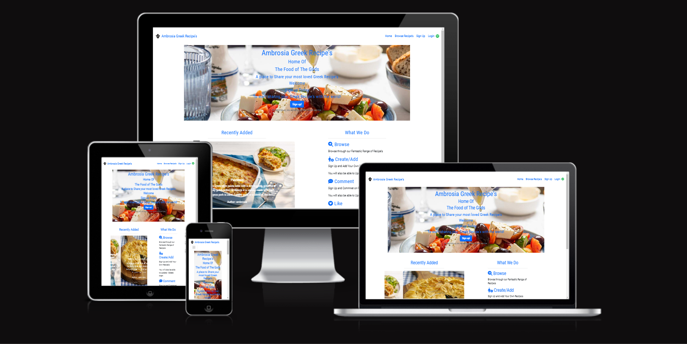
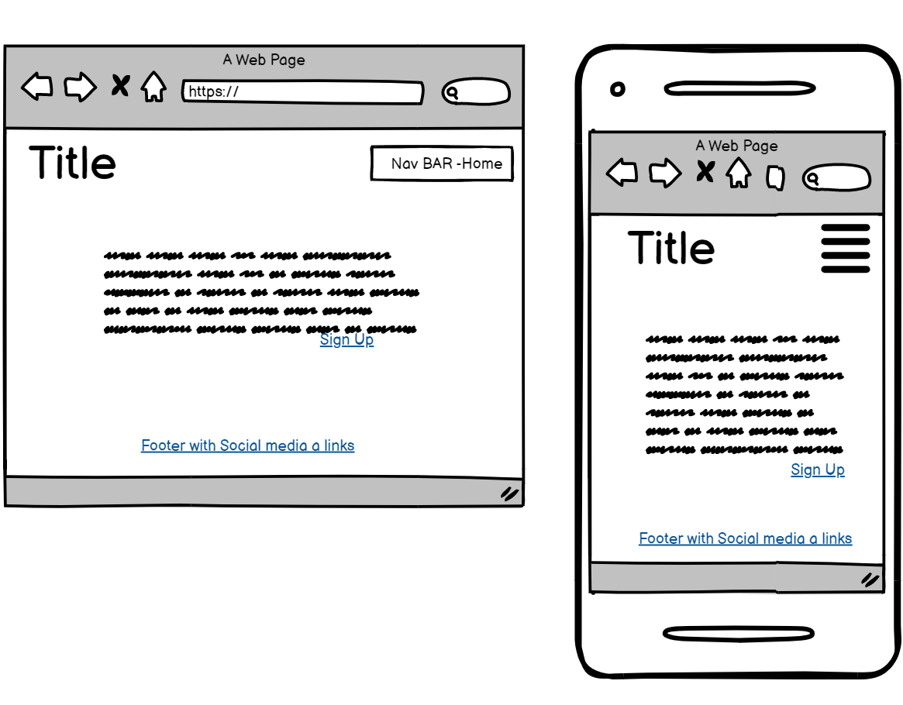
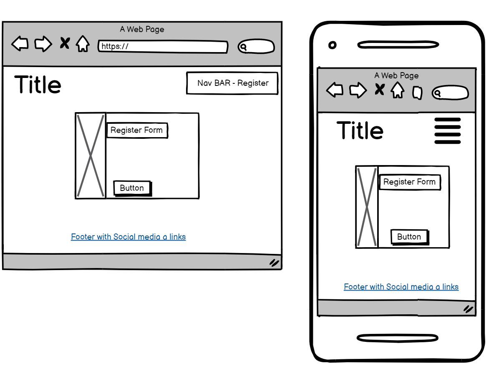
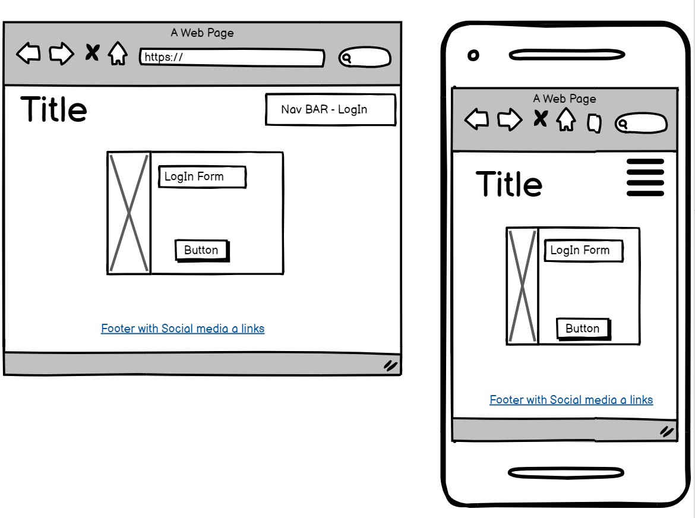
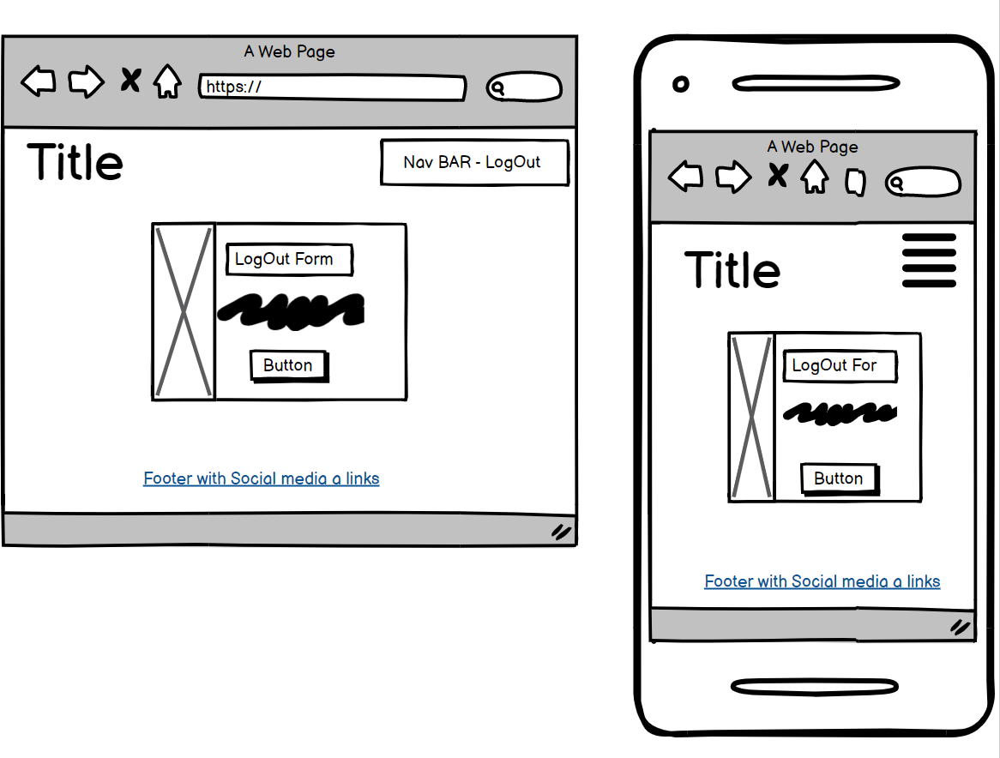
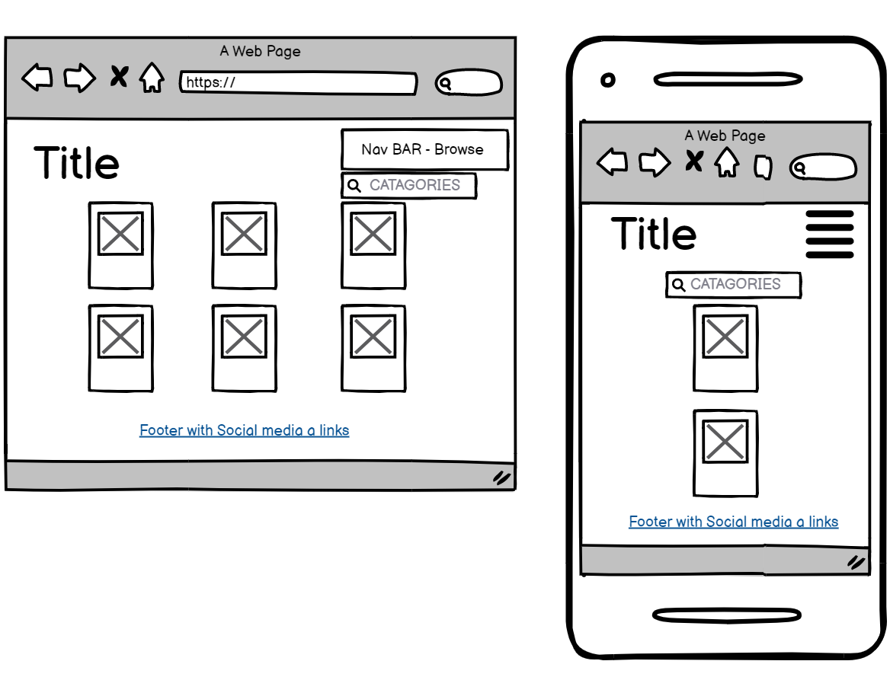
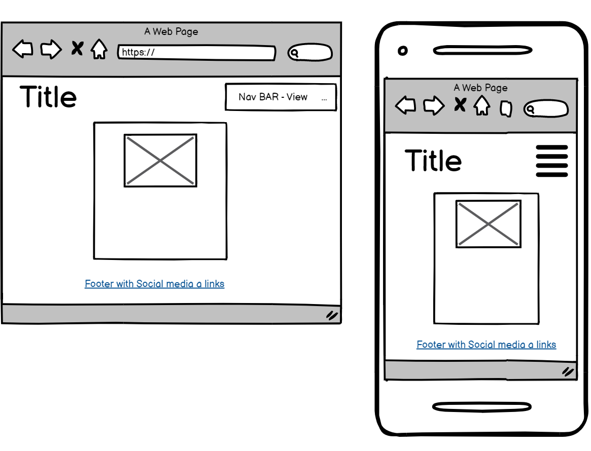
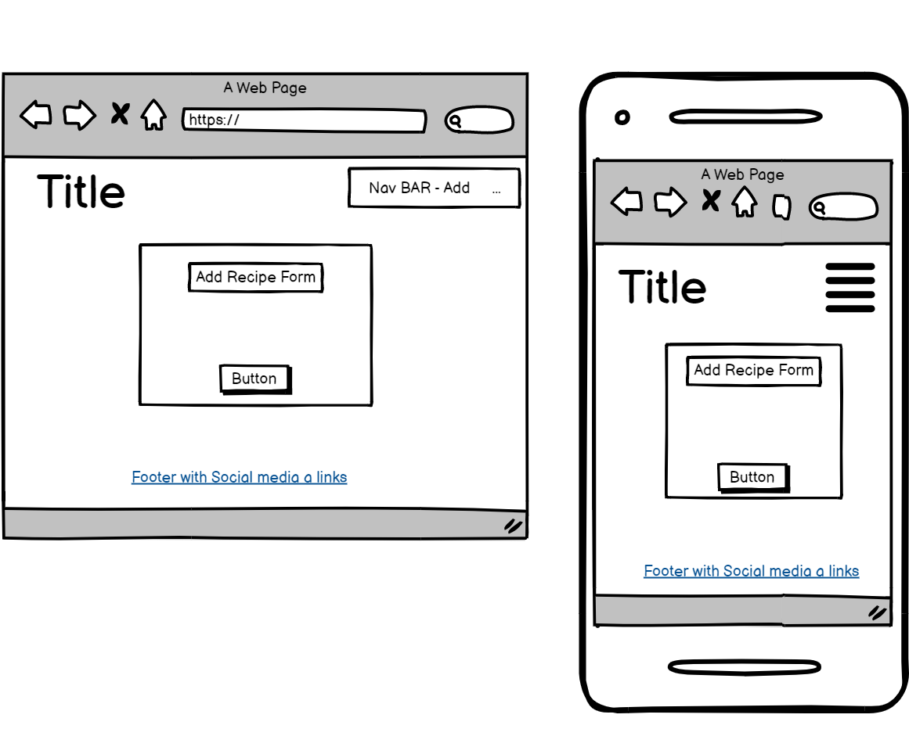
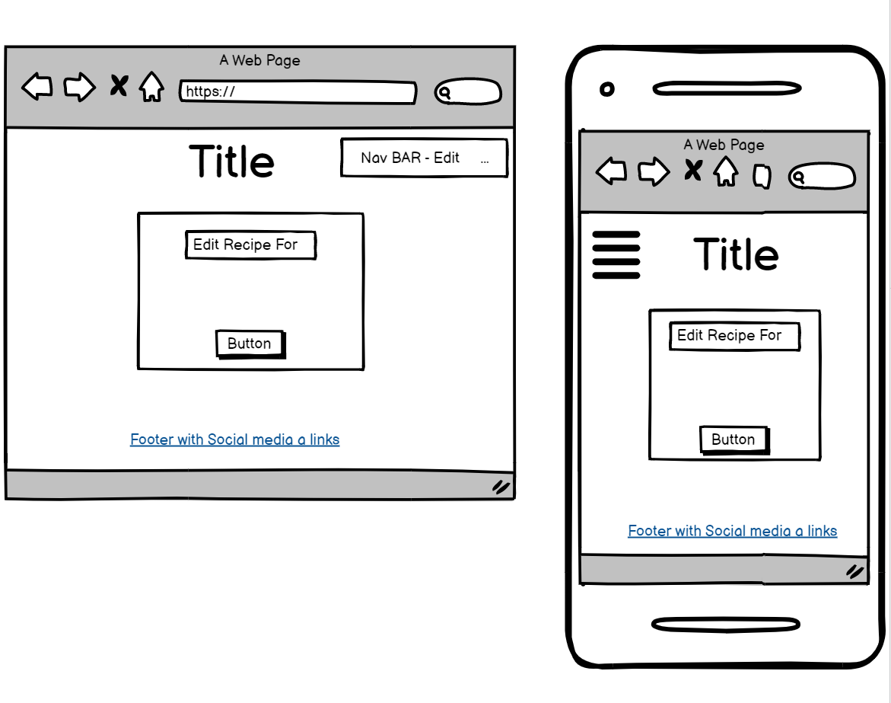

# Ambrosia Greek Recipe’s 

Live App link : [Ambrosia Greek Recipe's](https://ambrosia-greek-recipes.herokuapp.com/)

Ambrosia Greek Recipe’s is a user-friendly app that is base on the Greek Food and culture but is open to everyone who enjoys cooking and wishes to explore Greek Food and add their own recipes.
The site’s objective is to allow users to browse / view recipes weather they are a Registered user or not .
The site will allow a user to Register in order to add , update and delete their won recipes on the app and leave comments that the user can update or delete should they wish . Registered users can also like/unlike recipes.

# Contents

- [User Experience(UX)](#user-experience-ux)
   * [User Stories](#user-stories) 

- [Wireframes(Balsamiq Wireframes)](#balsamiq-wireframes)

## User Experience UX

As a App Developer and Designer I have tried to incorporate the Needs of the User along with a User Friendly navigation and astheticly pleasing App. 

## User Stories

I have used the Agile method starting with the Epics from which the User Stories are propogated and Task required to complete the User Stories. 

A full breakdonw of the [Kanban Board](https://github.com/TaraHelberg/Ambrosia-Greek-Recipe-s/issues?q=is%3Aissue+is%3Aclosed)

### EPIC | Home/Landing Page
- As a App Designer I require a Home/Landing Page so that the User can be introduced to the Recipes App and have a Definite place to Navigate and start using the app from.
  * [USER STORY: Navigation](https://github.com/TaraHelberg/Ambrosia-Greek-Recipe-s/issues/18)
       * [Tasks: Header, Title & Navigation](https://github.com/TaraHelberg/Ambrosia-Greek-Recipe-s/issues/22)
  * [USER STORY: Social Media App Links](https://github.com/TaraHelberg/Ambrosia-Greek-Recipe-s/issues/19)
       * [Tasks: Footer & Social Media Links](https://github.com/TaraHelberg/Ambrosia-Greek-Recipe-s/issues/23)
  * [USER STORY: Engaged in the App from the Start](https://github.com/TaraHelberg/Ambrosia-Greek-Recipe-s/issues/20)
       * [Tasks: Home Page Body -Engage User](https://github.com/TaraHelberg/Ambrosia-Greek-Recipe-s/issues/24)
       * [Tasks: Promote Registration Link](https://github.com/TaraHelberg/Ambrosia-Greek-Recipe-s/issues/25)

### EPIC | Browse Recipe's Page
- As a App Designer I require a Browse Recipe's Page so that App users can Browse the recipe's that they or others have added/posted even if the User is Registered user or not 
   * [USER STORY: Browse Recipes](https://github.com/TaraHelberg/Ambrosia-Greek-Recipe-s/issues/31)
       * [Tasks: Browse Recipe ](https://github.com/TaraHelberg/Ambrosia-Greek-Recipe-s/issues/32)
   * [USER STORY: Open a Recipe](https://github.com/TaraHelberg/Ambrosia-Greek-Recipe-s/issues/33) 
       * [Tasks: Open a Recipe to View entire recipe contents](https://github.com/TaraHelberg/Ambrosia-Greek-Recipe-s/issues/34)   

### EPIC | App Admin Manager
- As a App Designer I require an App Admin Manager so that The Admin Manager in charge of the App can oversee the Registered Users Posts & comments in order to moderate the App if needed
    * [USER STORY: App Admin Management](https://github.com/TaraHelberg/Ambrosia-Greek-Recipe-s/issues/28)
        * [Tasks: App Admin Management](https://github.com/TaraHelberg/Ambrosia-Greek-Recipe-s/issues/29)

### EPIC | User Profile 
- As a App Designer I require User Profile so that Potential users will have the ability to Register & Login to the App
    * [USER STORY: Account Registration & Login](https://github.com/TaraHelberg/Ambrosia-Greek-Recipe-s/issues/37)
        * [Tasks: Account Registration & Login/Log out ](https://github.com/TaraHelberg/Ambrosia-Greek-Recipe-s/issues/38)

### EPIC | Recipe Management
- As a App Designer I require a Registered User to be able to Add, Update & Delete Recipe as well as Comment on Recipes so that the Registered User can share Recipes to the Browse Recipe's page and Manage their Recipes for all Users to enjoy and add value to the App for All Users along with Registered users been able to add Comments for extra interaction with the App
    * [USER STORY Recipe Managment](https://github.com/TaraHelberg/Ambrosia-Greek-Recipe-s/issues/30)
        * [Tasks: Create a Recipe Front end ](https://github.com/TaraHelberg/Ambrosia-Greek-Recipe-s/issues/40)
        * [Tasks: Read Detail Recipe Front End](https://github.com/TaraHelberg/Ambrosia-Greek-Recipe-s/issues/41)
        * [Tasks: Update a Recipe Front End](https://github.com/TaraHelberg/Ambrosia-Greek-Recipe-s/issues/42)
        * [Tasks: Delete a Recipe Front End](https://github.com/TaraHelberg/Ambrosia-Greek-Recipe-s/issues/43)
        * [Tasks: Recipe Management - Comment On a Recipe](https://github.com/TaraHelberg/Ambrosia-Greek-Recipe-s/issues/39)
    * [USER STORY: Update & Delete Comments](https://github.com/TaraHelberg/Ambrosia-Greek-Recipe-s/issues/44)
        * [Tasks: Update & Delete Comments](https://github.com/TaraHelberg/Ambrosia-Greek-Recipe-s/issues/45)

### EPIC | Recipe Like's
- As a App Designer I can give my Registered Users the ability to like Recipes so that they have extra interaction with the App and can show to all users which recipes are more popular adding Value to the App 
    * [USER STORY: Likes ](https://github.com/TaraHelberg/Ambrosia-Greek-Recipe-s/issues/26)
        * [Tasks: Likes](https://github.com/TaraHelberg/Ambrosia-Greek-Recipe-s/issues/27)

### EPIC | Error Pages
- As a App Designer. I would require Error Handling pages so that any Errors that may occur due to either technical issues or access issues are handled, and that the user is informed and redirected accordingly if possible
    * [USER STORY: Error Pages](https://github.com/TaraHelberg/Ambrosia-Greek-Recipe-s/issues/47)
        * [Tasks: Error Pages](https://github.com/TaraHelberg/Ambrosia-Greek-Recipe-s/issues/48)

## Balsamiq Wireframes

Wireframe's are extreamly basic and did not incorporate all App pages. 
Wireframes where used as boiler plates to start the app design many updates and alterations made after the basic Wireframes where used to get started on the App.

Balsamiq Wireframes

Home Page 

Register 

Login 

LogOut 

Browse 

Recipe Details 

Add Recipe 

Update Recipe 

# Features

* Navigation 

     

# Home Page   

# Browse Recipe's

# Register

# 404 Error Page Not found

* 404.html Section
    

# Technologies / Support Used

* Below is a list of Technologies / Support I have used to build my site.
 
   

# Testing

  * Testing During development of the pages was done through the project to see how the project looked and felt

  * Manual Testing

| Feature           |  Expect              |  Action |  Result                 |
|-------------------|----------------------|---------|-------------------------|
|Header Title       |To go to Home Page    |Click On |Taken to Home Page       |
|Menu Bar           |To go to Named page   |Click On |Taken to Named Page      |
|Social Media Icons |To go to External Link|Click On |Taken to External Link   |
|Image links        |To go to Named page   |Click On |Taken to Named Page      |
|Internal links     |To go to Section      |Click On |Taken to Section of Page |
|External Links     |To go to External Link|Click On |Taken to External Link   |
|YouTube Video      |Play on request       |Click On |Plays on user request    |
|Google Map         |External if requested |Click On |External on user request |
 
* User Testing

    + Expectations
      As a user I wanted the site to 
     
    + Result
      As a user I was able to  
     
     
   

# Bugs

# Validator Testing

* Test Validators
    + HTML - W3C Html Validator - No errors returned when pass through .
    + CSS - W3C CSS Validator - No errors returned when pass through .
    + RESPONSIVENESS - Am I Responsive for different divices media queries.
    + LIGHTHOUSE - Website tested for Performance, Accessibility, Best Practice and SEO as seen below.

# Deployment of Project

* 

# Clone Project 

* Cloning of Project was made possible by GitHub
    + Go to Git Hub
    + Go to Off The Grid Living repository 
    + Click on it to go to main repository site 
    + Click on the Code drop down button menu next to the greeen Gippod button
    + Click on HTTP section you will see the http of the repository click on the window next to it it will say copied
    + Clikced on Download and Zip
    + Clicked on Open with GitHubDesktop
 

# Credits

   * Code Institute without who I would have had no base to begin a project & Readme.md Template .https://codeinstitute.net/ie/
   * GitHub for my workspace and saving all my work as well as my deployed project . https://github.com/
   * Reuben Ferrante my mentor without all his great guidance I would be lost. A Huge Thanks. https://github.com/arex18
   * The Slack community - for someone always been there no matter the time and with advice or direction. https://slack.com
   * Balsamiq used to build the wireframes for my project. https://balsamiq.com   
   * StackOverflow for all the information to assit with my project .https://stackoverflow.com
   * I am Responsive for a fantastic spot to see a visual of responsiveness. https://ui.dev/amiresponsive?msclkid=400b1adabe5b11ecbc48938198bb87b4
   * Lighthouse testing system whom I can't find a webpage link for but am grateful for been able to use.

* Copied Code / Code assistance  

# Imagery for Project

 * Images obtained via .... 

 
 

 + Image 1 . 
 + Image 2 . 
 + Image 3 . 
 + Image 4 . 
 + Image 5 . 
 + Image 6 . 
 + Image 7 . 
 + Image 8 . 

 
 ### Note 
 
