# Ambrosia Greek Recipe’s 

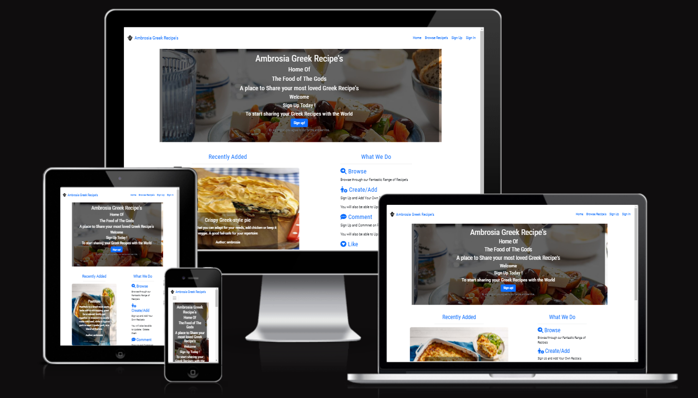

Live App link : [Ambrosia Greek Recipe's](https://ambrosia-greek-recipes.herokuapp.com/)

Ambrosia Greek Recipe’s is a user-friendly app that is base on the Greek Food and culture but is open to everyone who enjoys cooking and wishes to explore Greek Food and add their own recipes.
The site’s objective is to allow users to browse / view recipes weather they are a Registered user or not .
The site will allow a user to Register in order to add , update and delete their won recipes on the app and leave comments that the user can update or delete should they wish . Registered users can also like/unlike recipes.

# Contents

- [User Experience(UX)](#user-experience-ux)
   * [User Stories](#user-stories)
        * [Agile Method](#agile-method-git-projects)
        * [Future Features](#future-features) 
   * [Design](#design)
      * [Color Scheme](#colour-scheme)
      * [Images](#images)
      * [Font](#fonts)
      * [Wireframes(Balsamiq Wireframes)](#balsamiq-wireframes)
      * [Data Modle](#data-model)
   * [Security Features and Defensive Design](#security-features-and-defensive-design)
      * [User Authentication](#user-authentication)
      * [Form Validation](#form-validation)
      * [Database Security](#database-security)
      * [Custom error pages:](#custom-error-pages)

- [Features](#features)
   * [HomePage](#home-page)
   * [UserAccountPages](#user-account-pages)
   * [BrowsePage](#browse-recipes)
   * [RecipeViewPage](#recipe-view-page)          
        * [LeaveAComment](#leave-a-comment)
   * [UpdateAComment](#update-a-comment-page)
   * [DeleteAComment](#delete-a-comment-page)     
   * [AddRecipePage](#add-recipe-page)
   * [UpdateRecipePage](#update-recipe-page)
   * [DeleteRecipePage](#delete-recipe-page)

- [AdminControl](#admin-control)
   * [AdminControlPanel](#admin-control-panel)
   * [AdminLogin](#admin-login)
   * [RecipeControl](#recipe-control-page)
   * [CommentsControl](#comments-control-page)  

- [Technologies](#technologies)
   * [Programing Languuages](#programing-languages)
   * [Support Programs & Libraries](#support-programs--libraries)

- [Testing](#testing)
   * [Bugs](#bugs)
   * [ManualTesting](#manual-testing)
        * [NaviagtionHeader](#navigation-header)
        * [NaviagationFooter](#navigation-footer)
      * [HomePageManualTesting](#home-page-maual-testing)
        * [HeroImage](#hero-image-manual-test)
        * [RecentlyAddedManualTest](#recently-added-manual-test)
        * [WhatWeDoManualTest](#what-we-do-manual-test)
      * [SignUpManualTesting](#sign-up-manual-testing)
      * [SignInManualTesting](#sign-in-manual-testing)
      * [SignOutManualTesting](#sign-out-manual-testing)  
      * [BrowsePageManualTesting](#browse-page-maual-testing)
        * [RecipeCardManualTest](#recipe-card-manual-test)
        * [PaginateManualTest](#paginate-manual-test)      
      * [AddRecipeManualTesting](#add-recipe-manual-testing)
      * [ViewRecipeManualTesting](#view-recipe-manual-testing)
         * [Likes&CommentsMaualTesting](#likes--comments-maual-testing)
         * [CommentsManualTesting](#comments-manual-testing)     
         * [LeaveACommentsManaulTest](#leave-a-comments-manual-testing)         
      * [UpdateRecipeManualTesting]()
      * [DeleteRecipeManualTesting]()
      * [UpdateCommentManualTesting]()
      * [DeleteCommentManualTesting]()
      * [AdminControlManualTesting]()               
   * [Validation](#validator-testing)

- [Deployment](#deployment)
   * [Github](#github)
   * [Django and Heroku](#django-and-heroku)
   * [Forking](#forking)
   * [Clone Project](#clone-project)

- [Acknowledgments](#acknowledgments)
    * [Credits](#credits)
    * [CopiedCode&CodeAssistance](#copied-code--code-assistance)
    * [Note](#note)

## User Experience UX

As a App Developer and Designer I have tried to incorporate the Needs of the User along with a User Friendly navigation and astheticly pleasing App. 
The App is designed for use for anyone who wishes to enjoy Greek Food and has a love of cooking.

## User Stories

I have used the Agile method starting with the Epics from which the User Stories are propogated and Task required to complete the User Stories. 

### EPIC | Home/Landing Page
- As a App Designer I require a Home/Landing Page so that the User can be introduced to the Recipes App and have a Definite place to Navigate and start using the app from.
  * [USER STORY: Navigation](https://github.com/TaraHelberg/Ambrosia-Greek-Recipe-s/issues/18)
       * [Tasks: Header, Title & Navigation](https://github.com/TaraHelberg/Ambrosia-Greek-Recipe-s/issues/22)
  * [USER STORY: Social Media App Links](https://github.com/TaraHelberg/Ambrosia-Greek-Recipe-s/issues/19)
       * [Tasks: Footer & Social Media Links](https://github.com/TaraHelberg/Ambrosia-Greek-Recipe-s/issues/23)
  * [USER STORY: Engaged in the App from the Start](https://github.com/TaraHelberg/Ambrosia-Greek-Recipe-s/issues/20)
       * [Tasks: Home Page Body -Engage User](https://github.com/TaraHelberg/Ambrosia-Greek-Recipe-s/issues/24)
       * [Tasks: Promote Registration Link](https://github.com/TaraHelberg/Ambrosia-Greek-Recipe-s/issues/25)

### EPIC | Browse Recipe's Page
- As a App Designer I require a Browse Recipe's Page so that App users can Browse the recipe's that they or others have added/posted even if the User is Registered user or not 
   * [USER STORY: Browse Recipes](https://github.com/TaraHelberg/Ambrosia-Greek-Recipe-s/issues/31)
       * [Tasks: Browse Recipe ](https://github.com/TaraHelberg/Ambrosia-Greek-Recipe-s/issues/32)
   * [USER STORY: Open a Recipe](https://github.com/TaraHelberg/Ambrosia-Greek-Recipe-s/issues/33) 
       * [Tasks: Open a Recipe to View entire recipe contents](https://github.com/TaraHelberg/Ambrosia-Greek-Recipe-s/issues/34)   

### EPIC | App Admin Manager
- As a App Designer I require an App Admin Manager so that The Admin Manager in charge of the App can oversee the Registered Users Posts & comments in order to moderate the App if needed
    * [USER STORY: App Admin Management](https://github.com/TaraHelberg/Ambrosia-Greek-Recipe-s/issues/28)
        * [Tasks: App Admin Management](https://github.com/TaraHelberg/Ambrosia-Greek-Recipe-s/issues/29)

### EPIC | User Profile 
- As a App Designer I require User Profile so that Potential users will have the ability to Register & Login to the App
    * [USER STORY: Account Registration & Login](https://github.com/TaraHelberg/Ambrosia-Greek-Recipe-s/issues/37)
        * [Tasks: Account Registration & Login/Log out ](https://github.com/TaraHelberg/Ambrosia-Greek-Recipe-s/issues/38)

### EPIC | Recipe Management
- As a App Designer I require a Registered User to be able to Add, Update & Delete Recipe as well as Comment on Recipes so that the Registered User can share Recipes to the Browse Recipe's page and Manage their Recipes for all Users to enjoy and add value to the App for All Users along with Registered users been able to add Comments for extra interaction with the App
    * [USER STORY Recipe Managment](https://github.com/TaraHelberg/Ambrosia-Greek-Recipe-s/issues/30)
        * [Tasks: Create a Recipe Front end ](https://github.com/TaraHelberg/Ambrosia-Greek-Recipe-s/issues/40)
        * [Tasks: Read Detail Recipe Front End](https://github.com/TaraHelberg/Ambrosia-Greek-Recipe-s/issues/41)
        * [Tasks: Update a Recipe Front End](https://github.com/TaraHelberg/Ambrosia-Greek-Recipe-s/issues/42)
        * [Tasks: Delete a Recipe Front End](https://github.com/TaraHelberg/Ambrosia-Greek-Recipe-s/issues/43)
        * [Tasks: Recipe Management - Comment On a Recipe](https://github.com/TaraHelberg/Ambrosia-Greek-Recipe-s/issues/39)
    * [USER STORY: Update & Delete Comments](https://github.com/TaraHelberg/Ambrosia-Greek-Recipe-s/issues/44)
        * [Tasks: Update & Delete Comments](https://github.com/TaraHelberg/Ambrosia-Greek-Recipe-s/issues/45)

### EPIC | Recipe Like's
- As a App Designer I can give my Registered Users the ability to like Recipes so that they have extra interaction with the App and can show to all users which recipes are more popular adding Value to the App 
    * [USER STORY: Likes ](https://github.com/TaraHelberg/Ambrosia-Greek-Recipe-s/issues/26)
        * [Tasks: Likes](https://github.com/TaraHelberg/Ambrosia-Greek-Recipe-s/issues/27)

### EPIC | Error Pages
- As a App Designer. I would require Error Handling pages so that any Errors that may occur due to either technical issues or access issues are handled, and that the user is informed and redirected accordingly if possible
    * [USER STORY: Error Pages](https://github.com/TaraHelberg/Ambrosia-Greek-Recipe-s/issues/47)
        * [Tasks: Error Pages](https://github.com/TaraHelberg/Ambrosia-Greek-Recipe-s/issues/48)

[Back to top ⇧](#contents)

## Agile Method Git Projects

Github projects was used to manage the development process using an agile approach. Please see link to project [Kanban Board](https://github.com/TaraHelberg/Ambrosia-Greek-Recipe-s/issues?q=is%3Aissue+is%3Aclosed)

Not all Epics have made it into the projecy using the MSCW Method you will find on the Kandban Must have's,Should Have's,Could Have's and Wont have labels. The wont have labeled sections are those that did not make it into the App due to time constraint or due to design decision as in the case of the About Page.

## Future Features

Future Feature Link : [Won'tHaveKanbanBaord](https://github.com/TaraHelberg/Ambrosia-Greek-Recipe-s/issues?q=is%3Aissue+is%3Aclosed+label%3A%22Won%27t+Have%22)

### EPIC | Favourite Recipe's
[Link Here](https://github.com/TaraHelberg/Ambrosia-Greek-Recipe-s/issues/10)

### EPIC | Recipe's Pantry
[Link Here](https://github.com/TaraHelberg/Ambrosia-Greek-Recipe-s/issues/11)

### EPIC | Measurements Table
[Link Here](https://github.com/TaraHelberg/Ambrosia-Greek-Recipe-s/issues/12)

### EPIC | Search Recipes 
[Link Here](https://github.com/TaraHelberg/Ambrosia-Greek-Recipe-s/issues/53)

### EPIC | Recipe Categories 
[Link Here](https://github.com/TaraHelberg/Ambrosia-Greek-Recipe-s/issues/54)

[Back to top ⇧](#contents)

# Design

The App has a very clean and simplistic design which was purposely chosen in order to keep the App looking and feeling Authenticaly Greek and Easy to Navigate.

## Colour Scheme
Colour from BootStrap

Going with an Authentica Greek Themed App and choosing to stick to the colours most assosciated with Greece Blue and White this Developer was fortunate to choose Boostrap for many applications in this App a benifit of this been that Boostrap by default provided the Colour scheme required for this App.

## Images
There are four static image's on the App .
1. App Title Logo A Greek Urn
2. Hero Image a Greek Salad on the Home Page
3. BgIamge a meal-spices Image of Olive Oil and spices used as a background image for Forms
4. Place Holder image a small glass bowl with olive oil and olives used if a user does not upload a recipe image 
The rest of the imagery will be uploaded by users for their individual recipes. 

### Images Credit for Project

 

Pixabay

    
* [Images obtained via Pixabay](https://pixabay.com/)
     + Image 1 . [apptitleLog-greek-urn](https://pixabay.com/vectors/europe-greece-greek-pottery-vase-2028128/)
    + Image 2 . [heroimage-greek-salad](https://pixabay.com/photos/salad-greek-salad-feta-food-plate-5904093/)
    + Image 3 . [bgimage-meal-spices](https://pixabay.com/photos/meal-spices-laurel-salt-pepper-3191933/)
    + Image 4 . [placeholder-olive-oil](https://pixabay.com/photos/olive-oil-olives-food-oil-natural-968657/)
 

## Fonts
The font 'Roboto Condensed' is used as our main Body Font for the App. The Font IS imported via Google Fonts. Sans Serif is the backup font, in case for any reason the main font isn't being imported into the site correctly.

[Back to top ⇧](#contents)

# Balsamiq Wireframes

Wireframe's are extreamly basic and did not incorporate all App pages. 
Wireframes where used as boiler plates to start the app design many updates and alterations made after the basic Wireframes where used to get started on the App.

Balsamiq Wireframes

Home Page 

Register 

Login 

LogOut 

Browse 

Recipe Details 

Add Recipe 

Update Recipe 

[Back to top ⇧](#contents)

# Data Model

I used principles of Object-Oriented Programming throughout this project and Django’s Class-Based Generic Views.  

Django AllAuth was used for the user authentication system.
User Modal with the User_Id as the Primary Key

In order for the users to create recipes a custom recipe model was required. The recipe_id as the Primary Key and author as the foreign key to the User model given a recipe so that only one author can be connected to one recipe.

The Comment model allows users to comment on individual recipes and the Recipe_id is a foreign key in the comment model given a comment can only be linked to one recipe. 

The diagram below details the 

Database Flow Chart:

[Back to top ⇧](#contents)

# Security Features and Defensive Design

## User Authentication

Django's LoginRequiredMixin have been used to make sure that any requests to access secure pages by non-authenticated users / Authors are redirected.
Django's UserPassesTestMixin have been used to limit access based on permissions.
Eg: To ensure users can only Update / Delete Recipes or Comments for which they are the User / Author. 
    If the User /Author doesn't pass the test they are shown to the 403 Forbidden Error.

    
## Form Validation
    
If incorrect or empty information / data is added to a From, the Form won't submit and a warning will appear to the User / AUthor informing them what field raised the error.

## Database Security

The Database Url and secret key are stored in the env.py file to prevent unwanted connections to the Database and this was done at the beginning of the App set up and pushed to GItHub.

Cross-Site Request Forgery (CSRF) Tokens are used on all Forms within the App.
    
## Custom error pages:

Custom Error Pages have been created to give the User / Author more information and help redirect them when aor should an Error occur. These pages are provided with Redirect Buttons to appropriate area's of the App.
403 Error page shown as an Example of what the Error pages present to the User / Author.

Error Page Example Imagery

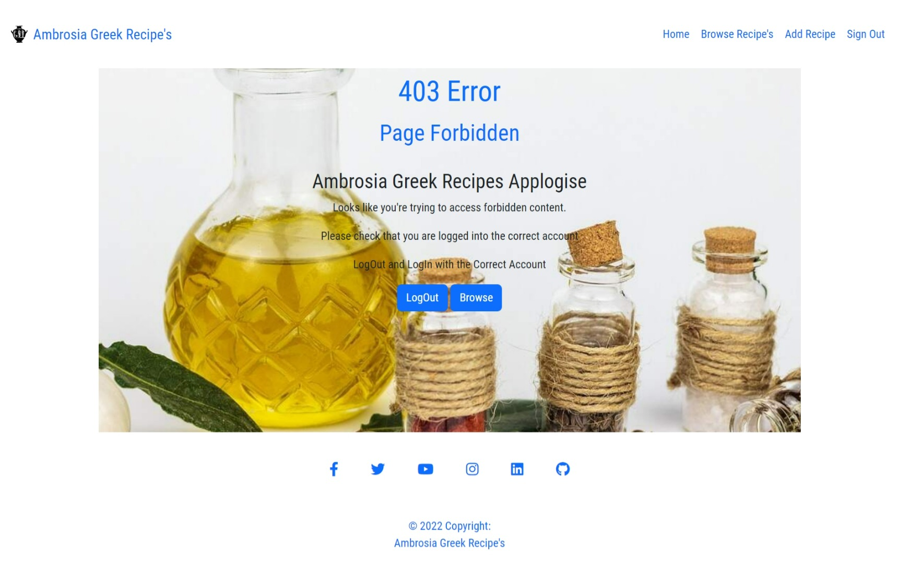

   ### 400 Error - Bad Request
   
   ### 403 Error - Access Forbidden Image 
        
   ### 404 Error - Page Not Found
   
   ### 500 Error - Server Error
   
[Back to top ⇧](#contents)

# Features

## Home Page 

Full Home Page Image :

 

The Home Page of the App incorporates the Following :

Header with App Title & Logo as well as Page Navigation included in is User Sign Up, Loging and Log out.

### Image of Header and Navigation when User is not Logged In
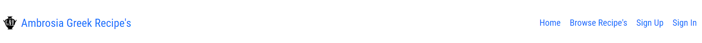

### Image of Header and Nacigation when User is Logged In
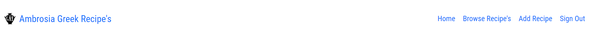

The Main Body of the page has a animated Hero image which encourages signup a call to action and once signed up and logged in shows when a User is Logged in and welcomes them to the App.

### Hero Image Call to Action - SignUp

### Hero Image Welcomes User and provides easy logout should user wish

 

Following this we have 2 sections below : 

The Recently Added section ona Bootsrap Carousel showing the 4 most recently added Recipes if a User clicks on any of the recipes in the Carousel they are taken to a Detailed view of the recipe.

### Recently Added Image

The What we Do section which gives the user the overall information on what the App is about and its useful features . If a User clicks on the Browse Icon the user is taken to the browes section of the App.

### What we Do Image

At the bottom of the App is the Footer section with social media links all of which open on a seperate tab outside of the App when Clicked on.

### Footer Iamge

[Back to top ⇧](#contents)

# User Account Pages

Full Sign Up Page Image :

 

The Sign Up page provides a Sign Up Form requesting the Username , Email and a Password that must be validated by inputting hte password a second time .
A Sign Up button is provided & Below these are two redirect buttons one for Login should the user already have an account and another to continue to Browse page should the user choose so .

Full Sign In Page Image :

 

The Sign In page provides the user with a Form requesting the Username & Password and a Sign In button.
Below these are two redirect buttons one for Sign Up should the user not have an account and another to continue to Browse page should the user choose so .

Full Sign Out Page Image :

The Sign Out page provides the user with a Thank You message and a Sign Out button.
Below these are one redirect button to continue to Browse page should the user choose so .

[Back to top ⇧](#contents)

# Browse Recipe's

Full Browse Page Image :

 

The Browse Page is set up to browse Recipes on Recipe cards set up with Pagination of 6 cards per page at the bottom of the page is the paginate Next button amd on moving to the next page is the paginate Prev button to take you back.

### Image of Paginate Next Button

### Image of Paginate Prev Button

Each card has the Basic information of the Recipe on the card consisting of Recipe Title, the Author of the Recipe ,a Date which shows when last the Recipe was Updated and a number of Likes Heart that has a counter next to it to show number of likes ,Number of people it Serves, Prep Time and Cooking Time .Each Recipe Card has  3 usable link buttons View to go to the Recipe Details View which any User can access to see the entire Recipe in Detail.A button to Update the Recipe and one to Delete the Recipe these two buttons will only be accesable to the Author/Owner of the Recipe and should another user try to use them they will be directed to an error page FOrbidden access 403 Error.

### Image of Recipe Card

[Back to top ⇧](#contents)

# Recipe View Page

Full Recipe View Page Image :

 

The View Page is a full detailed page view of the Recipe . Consisting of an Iamge of the Recipe or a Recipe place holder Image should the user not upload a recipe, under the Recipe Image is the Author name and Latest date of recipe upload or Update.
The Recipe , Tilte and dexription is next to the image under this is the number of People serves , Prep Time and cooking time.
Followed by two section under this of Ingredients and the Method.
The Ingredients and the Method section have a fantastic range of Rich Text.
Under the Full Recipe are 3 Button Links. Update & Delete only be accesable to the Author/Owner of the Recipe and should another user try to use them they will be directed to an error page FOrbidden access 403 Error. The Browse button will take any user to the Browse Page.

### Recipe View Deail Image

Under this section is the Like Heart which is only viable and accessable to a Logged In User to Like/Unlike the Recipe .
Next to the Like Heart is the Comments Count Icon which is visable to All users to show number comments on the recipe.

### Likes & Comments Logged In Image

### Likes & Commemnts Logged Out Image

This is followed by the Comments section showing the comments on the Recipe and can be views by all users.
Each comment has the Authors name and date with the Authors comment under it .

### Comments User Logged Out Image

When a User is Logged In the option to Update or Delete the comment via Button links is available however an error 403 Forbbiden message will be generated should the User not be the Author of that comment and tries to update or Delete a comment that is not allocated to them.

### Comments User Logged In Image

[Back to top ⇧](#contents)

## Leave a Comment

Next to this is the Leave a Comments section which is only accessable and visable to a Logged in User .
This shows the Author name under Posting as : .... & has a section for the User to Post the comment in the Body * section a submit button is supplied at the bottom.

### Image of Leave a Comment 

[Back to top ⇧](#contents)

# Update A Comment Page

Full Update A Comment Page Image :

 

The Update A Comment Page is only accessable to a Logged In User who is the User/Author of that Comment.
A Update Comment form is provided with the original comment present for the User/Author to update.
Two link buttons are supplied for the User/Author Choice to either Update the Comment or Cancel to leave the current Update Page which will return / Redirect the User/Author tot he Browsse Page.

[Back to top ⇧](#contents)

# Delete A Comment Page

Full Delete A Comment Page Image :

 

The Delete A Comment Page is only accessable to a Logged In User who is the User/Author of that Comment.
A Delete Comment page provides the User/Author with a Message in Red asking if they are sure they wish to Delete the Comment.
Two link buttons are supplied for the User/Author Choice to either Delete the Comment or Cancel to leave the current Delete Page which will return / Redirect the User/Author tot he Browsse Page.

[Back to top ⇧](#contents)

# Add Recipe Page

Full Add Recipe Page Image :

 

The Add Recipe Page is only available to Logged In Users.
On this page a simple form is provided to Add the recipe providing all the necessary input fields.
Title, Description, Serves, Prep Time, Cooking Time, Ingredients , Method and a Image section that allows the user to upload an Image of the Recipe by Choose File Button.
Within the Ingredients & Method Section the ability to create Rich Text is supplied giving the user / Author the ability to be a bit more creative should they so choose.
A sumbit button and a Cancel button are provided to the user. 

[Back to top ⇧](#contents)

# Update Recipe Page

Full Update Recipe Page Image :

)

 

The Update Recipe Page can only be reached if the User is that Recipes Author.
The Update Recipe Page Provides a form with the information already inputed by the User/Author on that particular recipe here the User/Author can update any details on the recipe that they should choose.
Within the Ingredients & Method Section the ability to create Rich Text is supplied giving the user / Author the ability to be a bit more creative should they so choose.

At the end of the form are two buttons Update and Cancel for the User/Auhtor use.

[Back to top ⇧](#contents)

# Delete Recipe Page

Full Delete Recipe Page Image :

 

The Delete Recipe page which can not be accessed unless the Recipe belongs to the User/Author brings up the Recipe you wish to Delete on a Recipe card with Basic details of the Recipe so that the User has a reminder of which recipe they are about to Delete.
A View Button and a Update Button are both supplied on the Recipe Card so that if the user wishes they can View the entire recipe to be sure they wish to delete it or head to the Update Recipe page instead.

Under the Card is a Message in Red asking if the User is Sure they wish to Delete the Recipe and to link buttons are provided Delete and Cancel which takes the User back to the Browse page for the User/Authors Choice.

[Back to top ⇧](#contents)

# Admin Control 

As the Admin of Greek Ambrosia Recipe's a area of Admin control was required .
Using Django's already set up system of Admin control a section was created for the Admin to login and be able to Approve Recipe's and Comments in order for the Admin to have Control over the App Content.

## Admin Control Panel

Full Admin Control Panel Page Image :

 

The Admin Control Panel is part of the Django Framework and assists the Admin in Controling the COntent of the App.
The Control panel welcomes the Admin with options to View Site / CHange Password and Logouot of the COntrol Panel.
From this area you are able to see Accounts , Authentication & Authorization , The setups you have used for you sight such as Django Summernote as well as haivng access to in the Case of our App ,Recipes section for Approval of Comments & Recipes that the User has uploaded to the App.

## Admin Login

As the Admin a Login Page was required in order to access the Admin Control Panel Area.
This is part of the Django Framework and supplies a simple form area requesting the Admin Username and Passowrd with a Log In button.

[Admin Login link](https://ambrosia-greek-recipes.herokuapp.com/admin/login/?next=/admin/)

### Image of Admin Login 

## Recipe Control Page

Full Recipe Control Page Image :

 

In our Recipes Control Page in Django Administration we are able to Add, Approve , Delete and Update Recipes via the Controls Supplied.

Highlighting the Recipe you wish to selcted and using hte drop down arrow by the Action bar will give you the option to Delete or Approve.

Clicking on the Recipe will open the Recipe up for you to view the entire contents and either approve or make updates to the Recipe as you need.

The option to use filters to find Recipes is also available .

## Comments Control Page

Full Comments Control Page Image :

 

In our Comments Control Page in Django Administration we are able to Add, Approve , Delete and Update Comments via the Controls Supplied.

Highlighting the Comment you wish to selcted and using hte drop down arrow by the Action bar will give you the option to Delete or Approve.

Clicking on the Comment will open the Comment up for you to view the entire contents and either approve or make updates to the Comments as you need.

The option to use filters to find Comments is also available .

[Back to top ⇧](#contents)

# Technologies

## Programing Languages 

- [HTML5](https://en.wikipedia.org/wiki/HTML5)
- [CSS3](https://en.wikipedia.org/wiki/Cascading_Style_Sheets)
- [Javascript](https://en.wikipedia.org/wiki/JavaScript)
- [Python](https://www.python.org/)
   
## Support Programs & Libraries

- [Git](https://git-scm.com/)
    - Version control.
- [GitHub](https://github.com/)
    - For storing code and deploying the site.
- [Gitpod](https://www.gitpod.io/)
    - Used for building and editing my code.
- [Django](https://www.djangoproject.com/)
    - A python based framework that was used to develop the site.
- [Bootstrap](https://getbootstrap.com/)
    - For help designing the html templates.
- [Google Fonts](https://fonts.google.com/)
    - Used to add style the website's font.
- [Font Awesome](https://fontawesome.com/)
    - Used to obtain the icons used.
- [Favicon.io](https://favicon.io/emoji-favicons/amphora/)
    - Used to generate the site's favicon.   
- [Google Developer Tools](https://developers.google.com/web/tools/chrome-devtools)
    - Used to help fix problem areas and identify bugs.
- [Cloudinary](https://cloudinary.com/)
    - Used to store static files and images.
- [SQlite](https://www.sqlite.org/index.html)
    - Used when performing unit tests.
- [PostgreSQL](https://www.postgresql.org/)
    - Database used through heroku. - until Update of Heroku when migrations and a change of Database was needed
- [ElephantSQL](https://www.elephantsql.com/)
    - Database used after migrations and following of all instructions from Code Institute James Stone
    - Information recieved via email.
    - Link 1 (https://code-institute-students.github.io/deployment-docs/02-elephantsql/elephantsql-01-sign-up)
    - Link 2 (https://code-institute-students.github.io/deployment-docs/80-migrating-databases-for-heroku/)
    - Link 3 (https://code-institute-students.github.io/deployment-docs/01-heroku-signup/heroku-03-converting-dynos)
- [Edrawmax](https://www.edrawmax.com/)
    - To draw out the database schema.
- [Balsamiq](https://balsamiq.com/)
    - To create the wireframes.
- [W3C Markup Validation Service](https://validator.w3.org/) 
    - Used to validate HTML code.
- [W3C CSS Validation Service](https://jigsaw.w3.org/css-validator/#validate_by_input)
    - Used to validate CSS code.
- [Pep8ci](https://pep8ci.herokuapp.com/) - Thank you Code Institute
    - Used to validate Python code found on slack #announcements
- [JSHint](https://jshint.com/)
    - Used to validate JS code.
- [Summernote](https://summernote.org/)
    - Used to add a WYSIWYG text box to the add recipe page.
- [Heroku](https://www.heroku.com/)
    - To deploy the project.

[Back to top ⇧](#contents)

# Testing 

* Testing During development of the App was done through the project in order to Test for Bugs, Maunal Testing was constantly done on all asspects of the App and Constant testing was done for the Responsiveness of the app via Dev Tools. Keeping an eye on the Look and Feel of the App.
  
## Bugs

Debug was kept on True in order to make use of Django's error page which came in use more often than not as a new Django Developer.

I as a new Django User & Developer encountered a great many Bug's .
Solving them through many different means.

The Bugs where generated from a lot of different errors I made from syntax errors to url errors as well as putting my url patterns in the wrong place one of which was puttting my paths below the slug that I used in the Url as this made the error of not reading the other path patterns.
Other errors included incorrect use of *args & *kwargs .
The incorrect use of Foreign Key vs Primary Key.

I appologies for the Lack of Bug / Error images . At the time of the Bugs I did get a bit busy trying to resolve them and forgot to take images of all the Bug's / Errors I managed to generate.

Solving of the Bug Error's was done via great deal of Research on different Dev sights but mostly via the methods below. 

Bug Erros solved via :
1 : Trial & Error - Trying the solutions all varied depending on the source 
2 : Stack Overflow 
3 : Djano Documentation
4 : CI Tutor support

Find below a few images of errors encountered and solved through the making of this App.

Images of Bugs / Errors

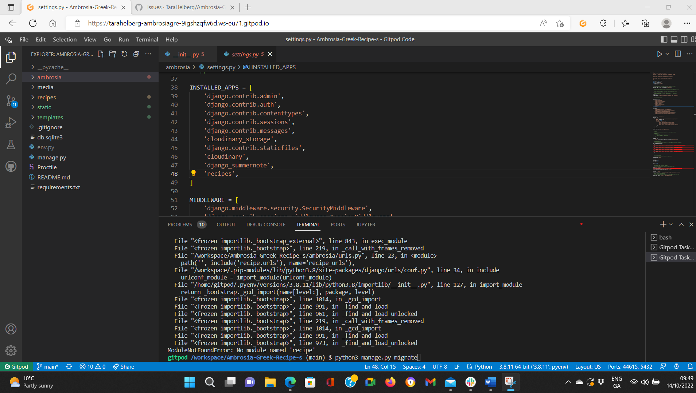

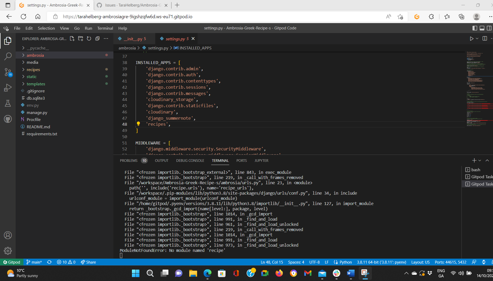

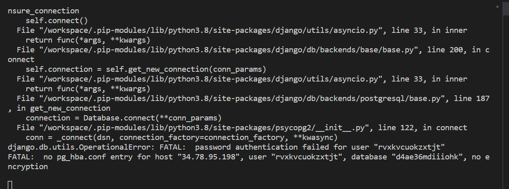

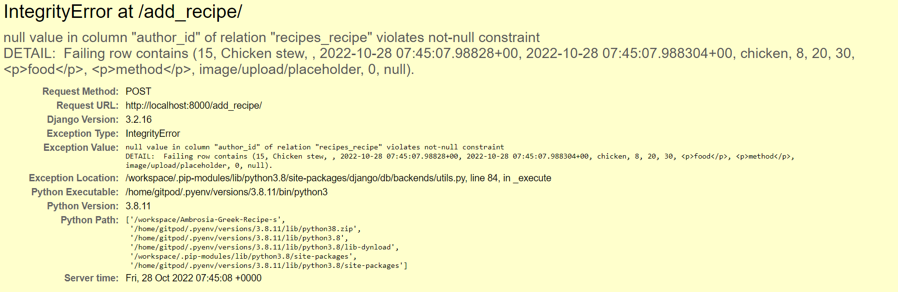

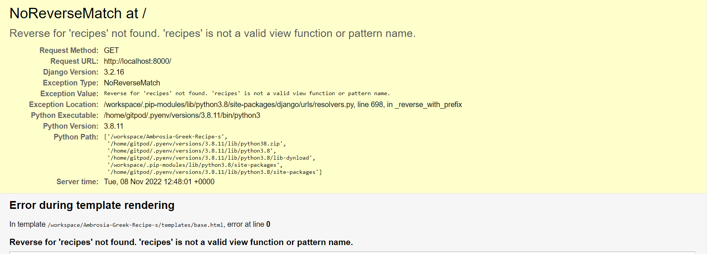

## Manual Testing

* User Testing

  * Expectations
     As a user I wanted the App to 
    1. A Appropriate Landing / Home Page 
    2. Home Page Welcomes , Engages and Informs of the Apps purpouse & Features 
    3. Easy to Follow Navigation
    4. Clear information to make choices on Each Page
    5. I expected to be able to Add,Read,Update & Delete my Recipes & Comments and Like other Recipes
    6. If i did something wrong I expected to be told and given directions       

  * Result
     As a user I was able to  
    1. The landing /Home page was Appropriate to the App
    2. Th Home page Welcomed , Engaged and Informed me of the Apps Purpouse & Features
    3. Navigation is easy to Follow & Understand
    4. Information is clear and I could make choices as to what I wished to do on each page 
    5. I was able to Add,Read,Update & Delete my Recipes & Comments and Like other Recipes with Ease
    6. When I made an error or did something wrong I was told and given directions on what I needed to do or options to help me move on.       

### Navigation Header

| Feature            |  Expect                       | Action   | Result    |
| ------------------ | ----------------------------- | -------- | ----------|
|  App Title & Logo  | Navigation Link               | Click On |   ✔       | 
|  Home              | Navigation Link               | Click On |   ✔       |
|  Browse Recipe's   | Navigation Link               | Click On |   ✔       |
|  Sign Up           | Navigation Link               | Click On |   ✔       |
|  Sign In           | Navigation Link               | Click On |   ✔       |
|  Sign Out          | Navigation Link               | Click On |   ✔       |
|  Add Recipe        | Navigation Link               | Click On |   ✔       |

### Navigation Footer

| Feature           |  Expect                       | Action   | Result    |
| ------------------| ----------------------------- | -------- | ----------|
|  Icon Facebook    | Navigation Link - external Tab| Click On |   ✔       |
|  Icon Twitter     | Navigation Link - external Tab| Click On |   ✔       | 
|  Icon YouTube     | Navigation Link - external Tab| Click On |   ✔       |
|  Icon  Instagram  | Navigation Link - external Tab| Click On |   ✔       |
|  Icon  Linkedin   | Navigation Link - external Tab| Click On |   ✔       |
|  Icon  GitHub     | Navigation Link - external Tab| Click On |   ✔       |

### Home Page Maual Testing

#### Hero Image Manual Test 

| Feature           |  Expect                           | Action   | Result    |
| ------------------| --------------------------------- | -------- | ----------|
|  Animation        | Hero Imange Zoom In/Out           | N/A      |   ✔       |
|  Sign Up Button   | Navigation Link                   | Click On |   ✔       |
|  Call to Action   | Visable when Not Signed In        | N/A      |   ✔       |
|  User Name        | Visable when Signed In            | N/A      |   ✔       |
|  Sign Out Button  | Navigation Link                   | Click On |   ✔       | 

#### Recently Added Manual Test 

| Feature             |  Expect                                     | Action   | Result    |
| --------------------| ------------------------------------------- | -------- | ----------|
|  4 Image Carousel   | Moves through Recently Added Recipes        | N/A      |   ✔       |
|  Arrow Controls     | Manual Moves through Recently Added Recipes | Click On |   ✔       |
|  View Detail Recipe | Views Detailed Recipe                       | Click On |   ✔       |

#### What We Do Manual Test 

| Feature             |  Expect                    | Action   | Result    |
| --------------------| -------------------------- | -------- | ----------|
|  Browse             | Navigation Link            | Click On |   ✔       |

### Sign Up Manual Testing

| Feature             |  Expect                      | Action    | Result    |
| --------------------| ---------------------------- | --------- | ----------|
|  Input Fields       | Able to input                |  Type     |   ✔       |
|  Sign Up Button     | To Next Page                 | Click On  |   ✔       |
|  Login Button       | Navigation Link - Login      | Click On  |   ✔       |
|  Browse Button      | Navigation Link - Browse     | Click On  |   ✔       |

### Sign In Manual Testing

| Feature             |  Expect                      | Action    | Result    |
| --------------------| ---------------------------- | --------- | ----------|
|  Input Fields       | Able to input                |  Type     |   ✔       |
|  Sign In Button     | To Next Page                 | Click On  |   ✔       |
|  Sign Up Button     | Navigation Link - Sign Up    | Click On  |   ✔       |
|  Browse Button      | Navigation Link - Browse     | Click On  |   ✔       |

### Sign Out Manual Testing

| Feature             |  Expect                      | Action    | Result    |
| --------------------| ---------------------------- | --------- | ----------|
|  Sign Out Button    | Sign Out                     | Click On  |   ✔       |
|  Browse Button      | Navigation Link - Browse     | Click On  |   ✔       |

### Browse Page Maual Testing

#### Recipe Card Manual Test

| Feature             |  Expect                    | Action        | Result    |
| --------------------| -------------------------- | ------------- | ----------|
|  Recipe Card Hover  | Card to Hover              | On Mouse Over |   ✔       |
|  View Button        | Navigation Link to View    | Click On      |   ✔       |
|  Update Button      | Navigation Link to Update  | Click On      |   ✔       |
|  Delete Button      | Navigation Link to Delete  | Click On      |   ✔       |

#### Paginate Manual Test

| Feature             |  Expect                      | Action    | Result    |
| --------------------| ---------------------------- | --------- | ----------|
|  Paginate Stnd Pc   | 3 Cards Per Row , 6 Per Page |   N/A     |   ✔       |
|  Next Button        | To Next Page                 | Click On  |   ✔       |
|  Prev Button        | To Prev Page                 | Click On  |   ✔       |

### Add Recipe Manual Testing

| Feature                        |  Expect                       | Action    | Result    |
| -------------------------------| ----------------------------- | --------- | ----------|
|  Input Fields                  | Able to input                 |  Type     |   ✔       |
|  Input Field Ingredients       | Rich Text Options             | Click On  |   ✔       |
|  Input Field Method            | Rich Text Options             | Click On  |   ✔       |
|  Image Choose File Button      | Able to choose file           | Click On  |   ✔       |
|  Submit Button                 | Submits Recipe Form           | Click On  |   ✔       |
|  Cancel Button                 | Cancels & Redirects to Browse | Click On  |   ✔       |

### View Recipe Manual Testing

| Feature                        |  Expect                        | Action    | Result    |
| -------------------------------| ------------------------------ | --------- | ----------|
|  View Full Recipe              | View Full Recipe               |  N/A      |   ✔       |
|  Update Button                 | Navigation Link - Only if User | Click On  |   ✔       |
|  Delete Button                 | Navigation Link - Only if User | Click On  |   ✔       |
|  Browse Button                 | Navigation Link - Browse       | Click On  |   ✔       |

#### Likes & Comments Maual Testing

| Feature                        |  Expect                         | Action    | Result    |
| -------------------------------| ------------------------------- | --------- | ----------|
|  Like / Unlike                 | Only if logged In Like / Unlike | Click On  |   ✔       |
|  Number Of Comments Shown      | See Number of Comments          | N/A       |   ✔       |

#### Comments Manual Testing

| Feature                        |  Expect                        | Action    | Result    |
| -------------------------------| ------------------------------ | --------- | ----------|
|  Comments View                 | To be able to view comments    | N/A       |   ✔       |
|  Update Button - If Logged In  | Navigation Link - Only if User | Click On  |   ✔       |
|  Delete Button - If Logged In  | Navigation Link - Only if User | Click On  |   ✔       |

#### Leave A Comments Manual Testing

| Feature                         |  Expect                        | Action    | Result    |
| --------------------------------| ------------------------------ | --------- | ----------|
|  Leave A Comment - If Logged In | Have access to Leave a Comment | N/A       |   ✔       |
|  Submit Button                  | Submit Comment                 | Click On  |   ✔       |

### Update Recipe Manual Testing

| Feature                        |  Expect                        | Action    | Result    |
| -------------------------------| ------------------------------ | --------- | ----------|
|  Input Fields - Filled in      | Able to see all previous input |  N/A      |   ✔       |
|  Input Fields - Update         | Able Update input              |  Type     |   ✔       |
|  Input Field Ingredients       | Rich Text Options              | Click On  |   ✔       |
|  Input Field Method            | Rich Text Options              | Click On  |   ✔       |
|  Image Current Iamge indicated | See current image              |   N/A     |   ✔       |
|  Image Choose File Button      | Able to choose file            | Click On  |   ✔       |
|  Submit Button                 | Submits Recipe Form            | Click On  |   ✔       |
|  Cancel Button                 | Cancels & Redirects to Browse  | Click On  |   ✔       |

## Validator Testing

   ### HTML - W3C Html Validator 
   
   

No Errors Found Html

   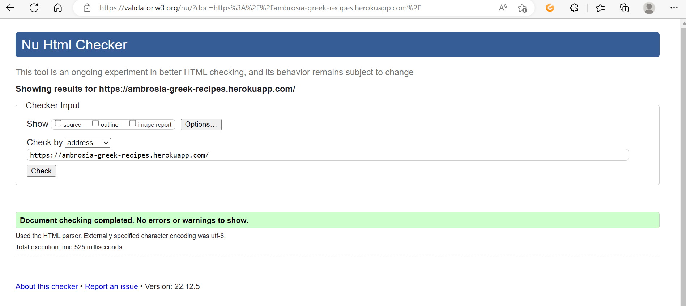
    
   

   ### CSS - W3C CSS Validator

   

No Errors Found Css

   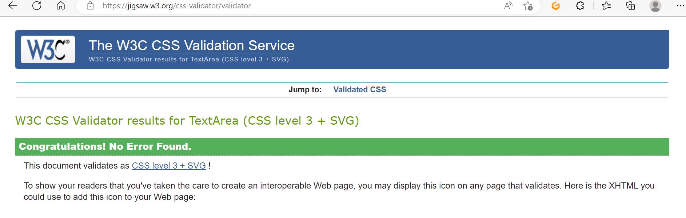
    
   

   ### Python - Pep8ci CI Python Linter
   
   * One example of the Pep8ci supplied but all .py files have been Validated & No Errors Found.  
   
   

No Errors Found Python Example Image

   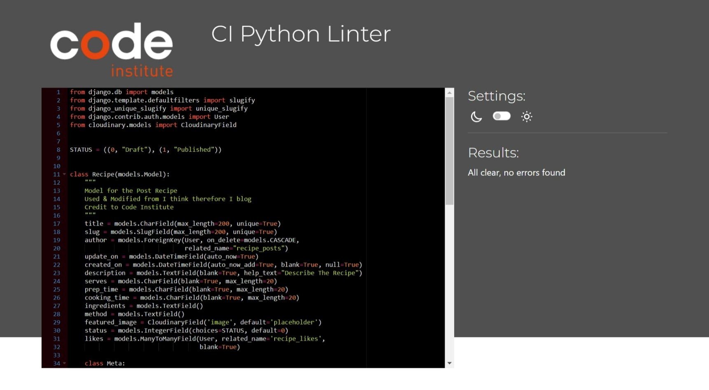
    
   
 
    
   ### Javascript - Jshint Validator
   
   

No Errors Found JavaScript

   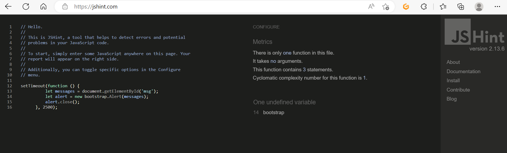
    
   
 
    
   ### Responsiveness 

   * Responsivesness tested via Google Dev Tools & Imagery checked Via Am I Responsive

   

Responsiveness Image

   
    
   
 
    
   ### Lighthouse - Website tested for Performance, Accessibility, Best Practice and SEO as seen below.
   

LightHouse Test Results

   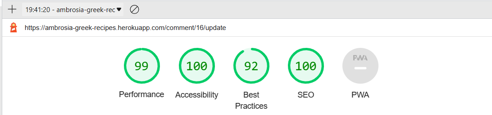
    
   
 

[Back to top ⇧](#contents)

# Deployment

This project was deployed using Github and Heroku.

- ## Github 

    * To create a new repository I took the following steps:

        + Logged into Github.
        + Click the ‘repositories’ section.
        + Click the green ‘new’ button to create new repository.
        + Choose ‘repository template’ Used the code institute template as recommended from the dropdown menu.
        + Add repository name then clicked the green ‘create repository button’ at the bottom of the page.
        + Open the new repository and clicked the green ‘Gitpod’ button to create a workspace in Gitpod for editing.

- ## Django and Heroku

    To get the Django framework installed and set up I followed the Code institutes [Django I Think Therefore I Blog cheatsheet](https://docs.google.com/document/d/1P5CWvS5cYalkQOLeQiijpSViDPogtKM7ZGyqK-yehhQ/edit). & Revisited the Walkthrough to assist.
    However due to changes made by Heroku changes where made when this occured & information recieved from Code Institute.
    The Steps then taken are below in the three links :
    - [PostgreSQL](https://www.postgresql.org/)
        * Database used through heroku. - until Update of Heroku when migrations and a change of Database was needed
    - [ElephantSQL](https://www.elephantsql.com/)
        * Database used after migrations and following of all instructions from Code Institute James Stone
        * Information recieved via email.
            + Link 1 (https://code-institute-students.github.io/deployment-docs/02-elephantsql/elephantsql-01-sign-up)
            + Link 2 (https://code-institute-students.github.io/deployment-docs/80-migrating-databases-for-heroku/)
            + Link 3 (https://code-institute-students.github.io/deployment-docs/01-heroku-signup/heroku-03-converting-dynos)

    
- ## Forking

    * Fork of Project was made possible by GitHub
        + Go to Git Hub
        + Locate the Fork button at the top right of the page.
        + Click on Fork Button. 
        + The Fork is now in your repositories.

- ## Clone Project 

    * Cloning of Project was made possible by GitHub
        + Go to Git Hub
        + Go to Off The Grid Living repository 
        + Click on it to go to main repository site 
        + Click on the Code drop down button menu next to the greeen Gippod button
        + Click on HTTP section you will see the http of the repository click on the window next to it it will say copied
        + Clikced on Download and Zip
        + Clicked on Open with GitHubDesktop
 
 [Back to top ⇧](#contents)

# Acknowledgments

I would like to take the time to Acknowledge & give credit to all the main assistances that I used whilst making my App.

## Credits

   * Code Institute without who I would have had no base to begin a project & Readme.md Template .https://codeinstitute.net/ie/
   * GitHub for my workspace and saving all my work as well as my deployed project . https://github.com/
   * Heroku for hosting my App . https://www.heroku.com/ 
   * Reuben Ferrante my mentor without all his great guidance I would be lost. A Huge Thanks. https://github.com/arex18
   * The Slack community - for someone always been there no matter the time and with advice or direction. https://slack.com
   * Code Institute Tutoring for assisting when I was trully stuck in particular John Traas who assisted with a Bug / Error and took the time to be understanding and helpful to a New Developer student. To be fare he was not the only one from the Turoring and my thanks to those I have not named.
   * Balsamiq used to build the wireframes for my project. https://balsamiq.com   
   * StackOverflow for all the information to assit with my project .https://stackoverflow.com
   * Django Documentation for all the invaluable information on how to use the features .https://docs.djangoproject.com/en/4.1/
   * I am Responsive for a fantastic spot to see a visual of responsiveness. https://ui.dev/amiresponsive?msclkid=400b1adabe5b11ecbc48938198bb87b4
   * Lighthouse testing system whom I can't find a webpage link for but am grateful for been able to use.

## Copied Code / Code assistance  

Code Institutes walkthough: I think therefore I Blog paid a big part in the stucture of my App as well as certain parts that are directly used and refered to in the code via commnets. In particular the Pagination , Comments & Likes of the App.

 ### Note

Recipes shown on this App have all been obtain from BBC Greek Cuisines https://www.bbc.co.uk/food/cuisines/greek .
All Recipes and information in this App are for Education perpouse only.

[Back to top ⇧](#contents)

  
 
